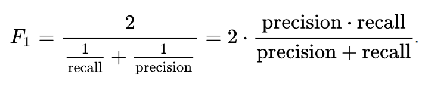
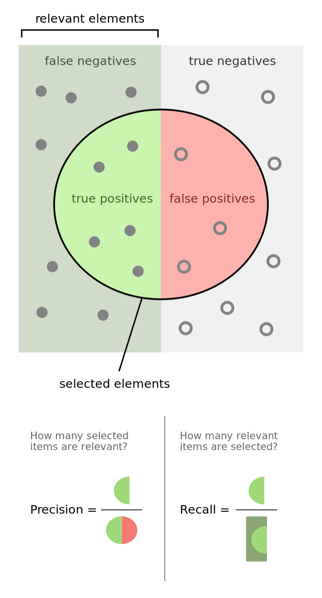

## F1-score

As you can see in the upper formula, It is harmony of precision and recall.

Precision : (correct yes-positive- answers) / (answers with yes-positive-)

Recall : (correct yes-positive- answers) / (all of correct answers)
