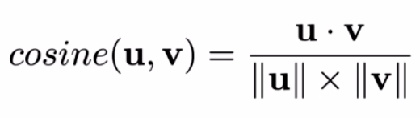

## cosine similarity( or cosine distance )

has value between -1 to 1(because it is cosine value)

If it is similar perfectly, 1.

The opposite is -1.

It can adapted to any dimensions.(But positive dimension)

similar things? -> [Euclidean distance](#)
