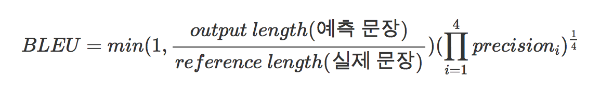

## BLEU(Bilingual Evaluation Understudy)

*Precision* means k-gram precision (k is 1 to n).

This k-gram precision is decided by 

(# of coinciding k-grams between output and groud truth) / (# of k-grams in sentences).
