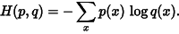
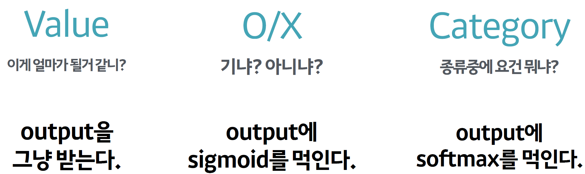

## Cross Entropy

In deeplearning, the data is mostly 'descrete value', so you can use cross entropy.
In this formula, usually p(x) is mostly given data. and q(x) is mostly the object.

Q: *Why we use __Maximum Log Likelihood Estimation__?*
A: First, we can prevent the probabilty to be very small. Second, even though, we added some log and - to the formula, it doesn't affect to getting proper theta(parameters). Also, it preserve the probability model.

Cross Entropy doesn't be specific about the which probablitic model would be.

The upper picture describe about cross entropy at when sitation.

