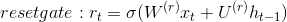

## Gated Recurrent Unit (GRU)

The one of cell from RNN(Recursive Neural Networks).
GRU keeps the good aspects of LSTM, and diminished the complexness of calculating. 
It overcome some [Gradient Vanishing/Explosion problems](gradient_vanishing_problem.md).

It is broadly divided into two parts, which are __update gate__ and __reset gate__

Two gates are also calculated by x_t and h_(t-1). Use sigmoid as a σ().

and for memory part, it use hidden layer h_t as like this:
Because activation function of reset gate is sigmoin, it has 0 to 1 value. It means, if it has 0 value, it forget everything, otherwise, remember everything.

The activation function of upper formula is hyperbolic tangent. It has value between -1 to 1. (Caution. It has no superscript or subscript, it means it is totally different parameters. 
Also, the odot mean [Hadamard product](../Math/hadamard_product.md).

The formula for updating to next state is this :

How much to combinate the former information and present information is determined by z_t by update gate.

The lower image shows how GRU is constructed.

[ What is different with LSTM ]

* GRU has 2 gates, otherwise LSTM has 3 gates.

* Inner memory value( c_t ) is not different from the value of hidden state value. This is because GRU doesn't have output gate that LSTM has.

* Input gate and forget gate is combined as z. Reset gate r is adapted directrly to hidden state.

* Doesn't adapt non-linear function for output
