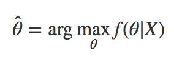
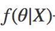
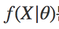

## maximum a posteriori estimation(MPE)

It was suggested to redeem the [MSE](cross_entropy.md).

If you use MLE, it will find the theta(parameters) that only can fit to the given data. However, if you use MPE, you can get parameters for more general situations. Sadly, to calculate the MPE, you need , but what we have is only  and we use [Bayes’ Theorem](../Math/bayes_theorem.md). 
