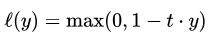

## hinge loss

Loss function used for training classifiers.

This functions is used for "maximum-margin" classfication.
ex) SVM

If it predicts right way, then it it will have l(y) = 0.
Otherwise, l(y) will increase linearly with y.
