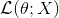

## semicolon in probability

This is about semicolon in PDF function.

ex)

&nbsp;&nbsp;

&nbsp;&nbsp;This means **the likelihood function of the theta with X being the *parameterized* of the distribution.**

Sure, it is different with 'condition' statement.
