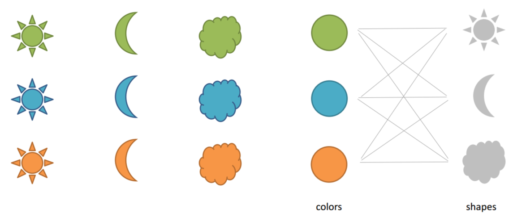

## distributed representation

If we represent something with one-hot-vector, the dimension of vector would be very large.

However, if we use distributed representation, we can represent the element with much smaller vector.

ex) If we try to explain below elements, it will neeed 9 dimension vector. However, we could represent it with just 2-dim vector,
with colors and shapes.

