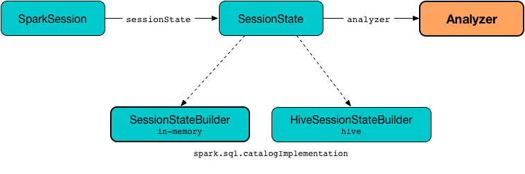

# Analyzer

Analyzer (aka Spark Analyzer or Query Analyzer) is the logical query plan analyzer that semantically validates and transforms an unresolved logical plan to an analyzed logical plan.

Analyzer is a concrete RuleExecutor of LogicalPlan (i.e. RuleExecutor[LogicalPlan]) with the logical evaluation rules.

```Analyzer: Unresolved Logical Plan ==> Analyzed Logical Plan```



Analyzer uses SessionCatalog while resolving relational entities, e.g. databases, tables, columns.

Analyzer is created when SessionState is requested for the analyzer.

reference : https://jaceklaskowski.gitbooks.io/mastering-spark-sql/spark-sql-Analyzer.html#execute
