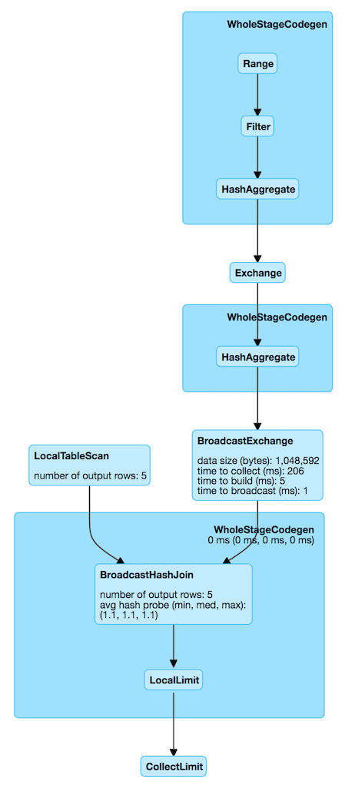

# Physical Query Plan

Physical Plan of structured query (Tree of SparkPlans)

See [SparkPlan](./SparkPlan.md)

article for Logical Plan vs Physical Plan in Spark : https://dzone.com/articles/understanding-optimized-logical-plan-in-spark
