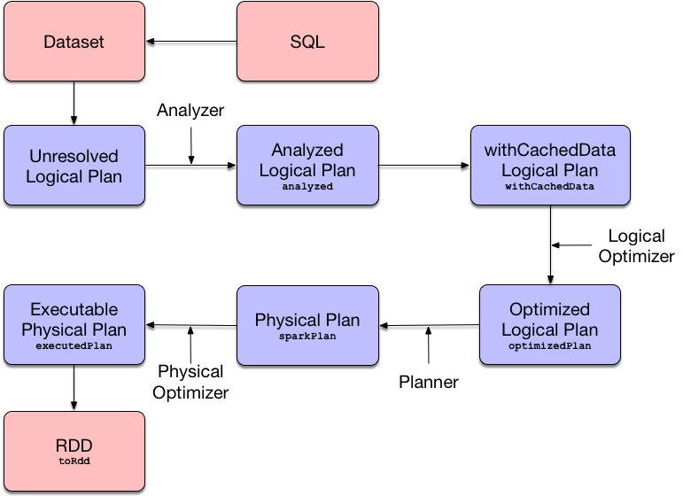

# Query Execution in Spark



QueryExecution is the result of executing a LogicalPlan in a SparkSession

When you execute an operator on a Dataset it triggers query execution that gives the good ol' RDD of internal binary rows, i.e. RDD[InternalRow], that is Spark’s execution plan followed by executing an RDD action and so the result of the structured query.


lazy attributes are in here

```
dataset.queryExecution.executedPlan
```

QueryExecution uses the Catalyst Query Optimizer and Tungsten for better structured query performance.


***QueryExecution*** uses the input ***SparkSession*** to access the current SparkPlanner when it is created.

It then computes a SparkPlan (a physicalPlan) using the planner.


reference : https://jaceklaskowski.gitbooks.io/mastering-spark-sql/spark-sql-QueryExecution.html
