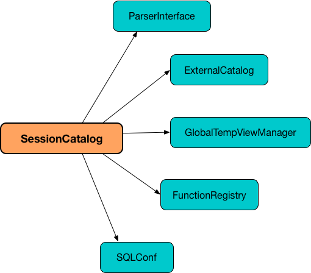

# SessionCatalog




SessionCatalog is the catalog (registry) of relational entities, i.e. databases, tables, views, partitions, and functions (in a SparkSession).

SessionCatalog is available through SessionState (of a SparkSession).

```
scala> :type spark
org.apache.spark.sql.SparkSession

scala> :type spark.sessionState.catalog
org.apache.spark.sql.catalyst.catalog.SessionCatalog
```
