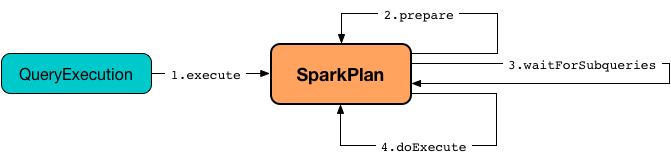
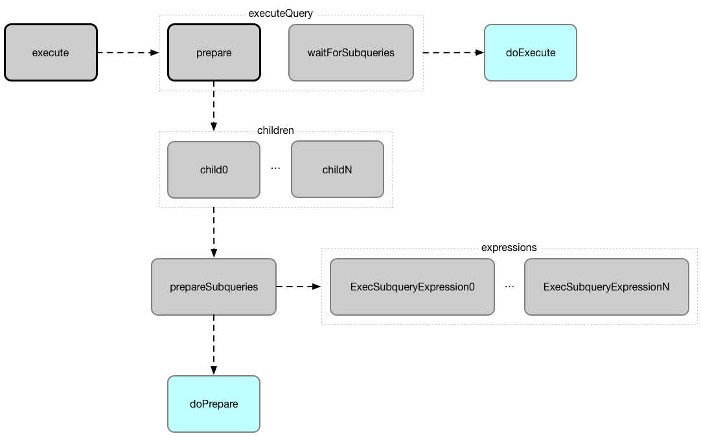

# SparkPlan

SparkPlan is the contract of physical operators to build a physical query plan (aka query execution plan).

The result of executing a SparkPlan is an RDD of internal binary rows, i.e. RDD[InternalRow].

The SparkPlan contract assumes that concrete physical operators define doExecute method (with optional hooks like doPrepare) which is executed when the physical operator is executed.
