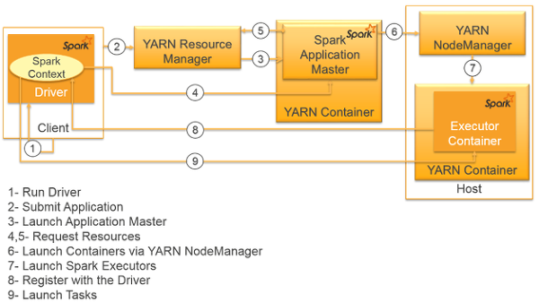
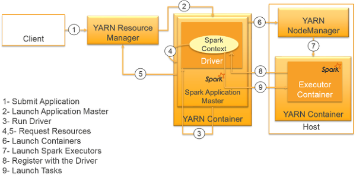

# spark-submit

In client mode, spark-submit run [driver](./DriverProgram.md) in the machine.
Can access to machine paths.

In cluster mode, spark-submit send [driver](./DriverProgram.md) to working node.

The default mode is client mode.
